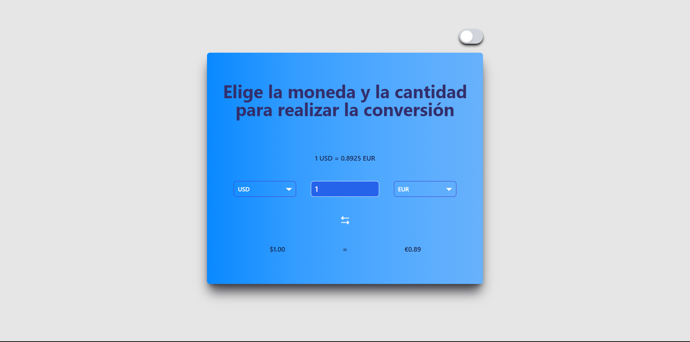
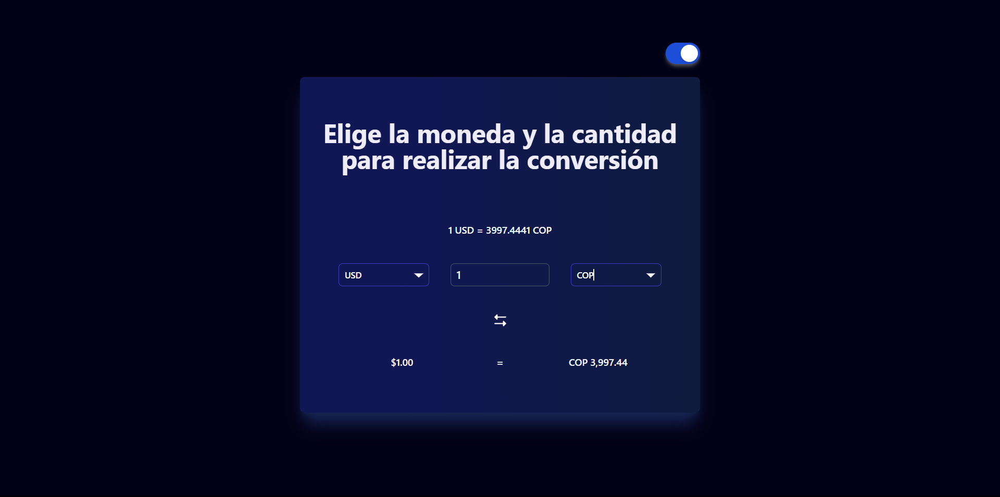

# Currency Converter in React

Welcome! This is a project of a currency converter application developed in React. It allows users to select different currencies, enter amounts, and obtain real-time exchange rates. Through this project, I have acquired fundamental skills in web development and React.

## Table of Contents

- [Demo](#demo)
- [Features](#features)
- [Technologies Used](#technologies-used)
- [Usage Instructions](#usage-instructions)
- [Screenshots](#screenshots)
- [Contribution](#contribution)
- [Author](#author)

## Demo

Here is a link to the [Live Demo](https://emutis21.github.io/conversor-javascript/) of the application.

## Features

- Selection of different currencies for conversion.
- Real-time exchange rate updates.
- Option to switch between dark and light mode.

## Technologies Used

- React Js
- Tailwind
- Sass
- Currency Conversion API

## Usage Instructions

1. Clone the repository to your local machine.
2. Navigate to the project directory and run `npm install` to install the dependencies.
3. Run `npm start` to start the application in development mode.
4. Open your browser and go to `http://localhost:3000` to see the application in action.

## Screenshots

## Contribution

Contributions are welcome. If you have any suggestions, improvements, or corrections, please create an issue or a pull request.

## Author

[Esteban Smith Mutis](https://github.com/emutis21)